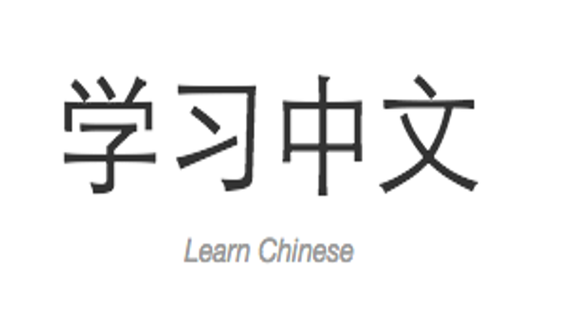
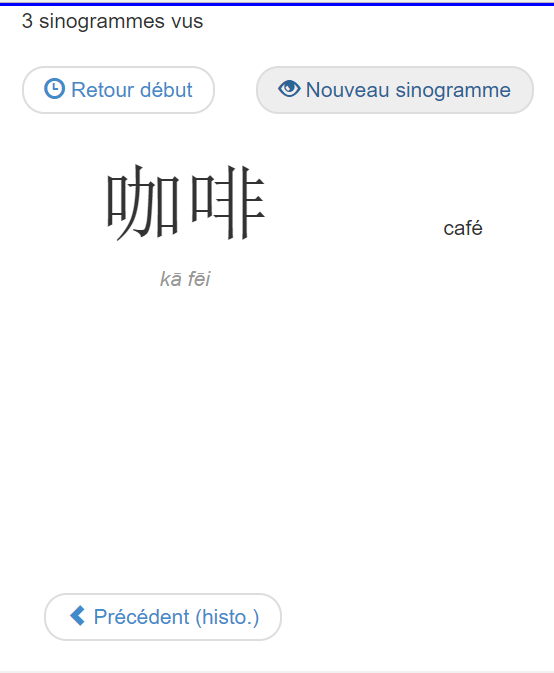

Learn-chinese
=============


This app allow you to learn chinese characters.

Click on "new character" to pick a random one. Each character is stored in session so you can come back ont it during you learning session.

[](https://travis-ci.org/nicolasgrancher/learn-chinese)



Characters are stored in SQLite file `web/app.db`.

# Installation

## With docker
```bash
$ git clone https://github.com/nicolasgrancher/learn-chinese.git
$ cd learn-chinese
$ cp .env.dist .env
```

Edit `.env` :
```bash
APP_NAME= # your app name

NGINX_PROXY_NETWORK= # network, leave empty if none

VIRTUAL_HOST= # vhost
LETSENCRYPT_HOST= # config for Let's Encrypt certificate
LETSENCRYPT_EMAIL= # config for Let's Encrypt certificate
```

Edit nginx configuration `docker/nginx/default.conf` and replace "VHOST" with your domaine name :
```
server {
    listen 443 ssl http2;
    ssl_certificate /etc/letsencrypt/VHOST.crt;
    ssl_certificate_key /etc/letsencrypt/VHOST.key;

    server_name VHOST;
    ...
```

Launch it :
```bash
$ docker-compose up --build -d
```
Install vendors :
```bash
$ docker-compose exec php bash
bash-4.3# composer install
...
bash-4.3# exit
```
